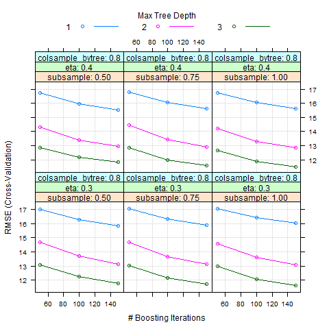

```{r config_chunk, echo = FALSE, warning=FALSE, message=FALSE}
# Adjust the size of the output to 70 % when creating the pdf.
knitr::opts_chunk$set(out.width = '70%') 
# knitr::opts_chunk$set(echo = TRUE) # this was original
```


## ABSTRACT

  The analysis included in the document are part of the second and the final capstone assignment, required for the completion of the Professional Certificate in Data Science from HarvardX, which is provided online on the EDX platform.
  
  I have chosen the "Superconductivity Data Set" provided on UCI Machine Learning Repository. The original data was collected by National Institute for Materials Science (NIMS) (https://supercon.nims.go.jp/en/) and is publicly available.
  
  The original superconducting material database from NIMS was cleansed and wrangled by UCI and made available for the download. It contains various physical, chemical and atomic properties of the elements used to build different superconducting materials.
  
  The goal of this project is to create statistical model for predicting critical temperature of various superconductors.
  

## INTRODUCTION

  Superconductivity is a special property of certain materials, which allow for a flow of the electrical current with no electrical resistance. It was discovered and first observed by a Dutch physicist Heike Kamerlingh Onnes in 1911. Since then the superconductivity phenomenon was heavily researched by many scientists, and later explained by Bardeen–Cooper–Schrieffer theory, for which they obtained the Noble Prize in 1972.

  Due to this very attractive property, it found use in many branched of our lives. Among others it is used to build powerful magnets used in medicine in MRI (Magnetic Resonance Imaging) as well as in physic in particle colliders (e.g. CERN), and allows for lossless transportation of electricity. It is also used to build qubits in certain type of Quantum Computers.
  
  The details of the physics, which make superconductivity possible, are beyond the scope of this project, however it is worth to mention that it can be explained by quantum mechanical effects (Bardeen–Cooper–Schrieffer theory).
  
  Vast majority of known superconductors exhibits vanishing of the electrical resistance only at very low temperatures, and one important property, which describes superconductor materials is called *critical temperature*. This critical temperature marks the abrupt phase transition from the normal material into superconductor.
  
  First superconductivity was discovered at very low temperatures, in a range of a few Kelvins, which is only a bit above the absolute 0. More and more superconducting materials are discovered every month, and the *holy grail* of the field are so called room temperature semiconductors.
  
  Despite the advances in quantum chemistry and physic and deeper understanding of the mechanics behind superconductivity, it is still in most cases trial and error task to discover new superconductors. One aspect, which recently gained some attention, is data driven, statistical approach to predicting critical temperatures.
  
  "Superconductivity Data Set" was created for that purpose. It contains chemical element composition and various properties of 20000+ of known superconductors.
While in this project the goal is to predict the critical temperature of the *known* superconductors based on the chemical and physical properties of the materials, the statistical approach can help in better understanding and discovery of the new higher temperature superconducting materials.


## LOAD THE LIBRARIES AND DOWNLAOD THE DATA


I will Download Superconductivity Data Set from UCI Machine Learning Repository.
It is available under the following URL:
https://archive.ics.uci.edu/ml/datasets/Superconductivty+Data


### This section will install necessary packages and load the libraries

I will need and use the following libraries in this project.

```{r check and install packages, message=FALSE, echo=TRUE, warning=FALSE}
if(!require(tidyverse)) install.packages("tidyverse", repos = "http://cran.us.r-project.org")
if(!require(caret)) install.packages("caret", repos = "http://cran.us.r-project.org")
if(!require(readr)) install.packages("readr", repos = "http://cran.us.r-project.org")
if(!require(data.table)) install.packages("data.table", repos = "http://cran.us.r-project.org")
if(!require(ggthemes)) install.packages("ggthemes", repos = "http://cran.us.r-project.org")
if(!require(broom)) install.packages("broom", repos = "http://cran.us.r-project.org")
if(!require(viridis)) install.packages("viridis", repos = "http://cran.us.r-project.org")
if(!require(matrixStats)) install.packages("matrixStats", repos = "http://cran.us.r-project.org")
if(!require(corrplot)) install.packages("corrplot", repos = "http://cran.us.r-project.org")
if(!require(ClusterR)) install.packages("ClusterR", repos = "http://cran.us.r-project.org")
if(!require(glmnet)) install.packages("glmnet", repos = "http://cran.us.r-project.org")
if(!require(xgboost)) install.packages("xgboost", repos = "http://cran.us.r-project.org")
if(!require(DiagrammeR)) install.packages("DiagrammeR", repos = "http://cran.us.r-project.org")


library(tidyverse)
library(caret)
library(readr)
library(data.table)
library(ggthemes)
library(broom)
library(viridis)
library(matrixStats)
library(corrplot)
library(ClusterR)
library(glmnet)
library(xgboost)
library(DiagrammeR)
```


### Download source files

  Download the dataset from URL: https://archive.ics.uci.edu/ml/datasets/Superconductivty+Data

```{r download the source data, message=FALSE}
# Download the source data
dl <- tempfile()
download.file("https://archive.ics.uci.edu/ml/machine-learning-databases/00464/superconduct.zip", dl)


# get the name of the zipped file
fname_zipped = dl

# list all files names inside of a .zip file
fnames = as.character(unzip(fname_zipped, list = TRUE)$Name)

# read every file into R, assuming they are .csv files
lst = vector("list", length(fnames))
for (i in seq_along(fnames))
  lst[[i]] = read.csv(unz(fname_zipped, fnames[i]), stringsAsFactors = F)


# assign different files from the .zip to different data frames
unique_m <- lst[[1]]
train <- lst[[2]]

rm(dl,lst,fname_zipped)
```


### First quick look at the data  

  Let's glance and see a first few rows of the data

```{r firts look, message=FALSE, warning=FALSE}
glance(train)
glance(unique_m)

head(train) %>% knitr::kable("pipe")
head(unique_m) %>% knitr::kable("pipe")
```
### Cleaning data  

  After downloading the data, my first observation is that *train* file contains various physical properties of the material and *unique_m* contains chemical element decomposition of the material. Critical_temp column occurs in both dataframes. I will attempt to use both sets of features in my predictive models, and will therefore drop it in the train before binding them together.

  After binding I observed, that there are rows, which are duplicated, and only differ by the critical temperature. This is invalid, as each compound should have one critical temperature value. After further investigation, I found out that it is probably a result of the way the original data was collected: from various scientific papers, done by the scientists using different methods. Different critical temperatures for the same material are likely either due to measurement error or different parameters of the experiments.
  
  Whatever the underlying reason, I need to take it into account, and perform additional data manipulation. First step was to identify all duplicates. Then I analyzed them and came up with the criteria whether to keep or drop these rows. 
  I have decided to keep the material, if all observations are within 1.5 standard deviation of the mean critical value calculated for all observations of the same material. In that case I keep only one row, and replace material's critical temperature with mean of all observations. Based on that criteria I kept almost 88% of these problematic materials.
  

```{r remove duplicates, message=FALSE}
superconductors <- cbind(select(train,-critical_temp),unique_m)

# after that last by one column contains critical temperature of the semiconductor, and last column 
# contains chemical compound of the superconducting material

# row.names(superconductors) <- superconductors$material
# !!! This above fails! It turns out there are duplicate rows !!!!
# I need to work on the dataset, in order to eliminate these duplicates

# count of the unique rows:
all_unique <- superconductors %>% 
  distinct(material, .keep_all = TRUE)
length(all_unique$material)   #  15542
 

indx <- superconductors$material[ duplicated(superconductors$material) == TRUE ]


# Interestingly some materials occur twice or more times in the dataframe and the only difference 
# is the critical temperature. 


all_duplicated_materials <- superconductors %>% group_by(material) %>% 
  summarise(n=n(), critical_temp = critical_temp, mean_ct = mean(critical_temp), std = sd(critical_temp), 
             std_low = ( abs(critical_temp - mean_ct) < std), keep_material_std1 = (mean(std_low) == 1),
             std_low1_5 = ( abs(critical_temp - mean_ct) < 1.5*std),
             keep_material_std1_5 = (mean(std_low1_5) == 1)) %>% 
  filter(n > 1) %>% arrange(desc(n))

# it is 7982 rows

# check how many and which materials to keep based on the criteria that all CTs (Critical Temps)
# are within 1 standard deviation from the mean

to_keep_1sd <- all_duplicated_materials %>% group_by(material) %>% summarise(n = n(), sd = first(std) ,crit_temp = first(mean_ct), keep = first(keep_material_std1))
mean(to_keep_1sd$keep)


# check how many and which materials to keep based on the criteria that all CTs (Critical Temps)
# are within 1.5 standard deviation from the mean
to_keep_1_5sd <- all_duplicated_materials %>% group_by(material) %>% summarise(n = n(), sd = first(std) ,crit_temp = first(mean_ct), keep = first(keep_material_std1_5))
mean(to_keep_1_5sd$keep)  # 0.8796992


#
# # Let's join the table and examine two examples, which we would keep under "1_5 sd" criteria, but reject under "1 sd"
#
# to_keep_compare <- left_join(to_keep_1sd,to_keep_1_5sd, by = c("material","sd","n","crit_temp"))
#
# materials <- to_keep_compare %>% filter(keep.x != keep.y) %>% arrange(desc(n)) %>% pull(material)
# materials_to_examine <- materials[1:3]
#
# sup_to_exam <- superconductors %>% filter(material %in% materials_to_examine) %>% select(material,critical_temp) %>% arrange(material)
#
#
# # Here is the table
# all_duplicated_materials %>% filter(material %in% materials_to_examine) %>% knitr::kable("pipe")

# OK I will KEEP all materials, which pass the "1_5*SD" criteria)
# which means mean(to_keep_1_5sd$keep)  # 0.8796992 of the duplicate entries


# here I will make that final dataframe:

# first I will extract names of all duplicated superconductors

all_dups_names <- all_duplicated_materials %>% group_by(material) %>% pull(material)

# filter superconductors only by these
sup_filtered <- superconductors %>% filter(material %in% all_dups_names)

dim(sup_filtered)
# drop all which I will not keep due to "1_5 sd" rule
for_filter <- to_keep_1_5sd %>% filter(keep == TRUE) %>% pull(material)
sup_filtered <- sup_filtered %>% filter(material %in% for_filter)
dim(sup_filtered)

# summarize by material and replace critical_temp with the mean
sup_filtered <- sup_filtered %>% group_by(material) %>% mutate(av_temp  = mean(critical_temp)) %>%
                distinct(material, .keep_all= TRUE)
sup_filtered <- sup_filtered %>% mutate(critical_temp = av_temp) %>% select(-av_temp)
dim(sup_filtered)

# now I construct final dataframe by dropping all duplicated material rows in superconductors df 
# and re-adding dataframe constructed in the previous step, which contains only one row for each
# duplicated material, which I will keep, and uses mean critical_temp of the original entries

superc_final <- superconductors %>% filter( !(material %in% all_dups_names))
superc_final <- rbind(superc_final,sup_filtered)

# after binding both dataframes now I have final one with 15270 unique entries
dim(superc_final)

# I double check that all rows are now unique:
superc_final %>% group_by(material) %>% 
  summarise(n=n()) %>% filter(n != 1) 

# this test creates empty dataframe, confirming that cleaning of the data is completed
```


## EXPLORATORY DATA ANALYSIS AND VIZUALIZATIONS  

  Let's now examine and visualize certain properties of the dataset, in order to decide which features can be best used as a predictors in my models.


  My final dataset contains the following amount of rows and features. There is no N/As.
  
  
```{r basic statistics, echo = FALSE, warning=FALSE}
glance(superc_final)

```

  One can ask a question: how often given atom appears in the superconductor?
First 81 columns describe physical and chemical properties of different semiconductors and columns 82 - 167 describe elements in given superconductor and number of elements forming it.
Please note that it can be fractional number - if certain atom is shared across few bigger cells building given chemical compound.

### Table and graph showing how often given element is present in semiconductors  

```{r element histogram, echo = FALSE, warning=FALSE}
# what is the distribution of atoms used?
elements_distr <- superc_final[82:167] %>% summarise(across(everything(),
                        list(min = min, max = max, sum = sum, mean = mean, sd = sd)))

ed <- elements_distr %>% gather() %>%  separate(key,c("element", "feature"), sep="_") 

ed_for_graph <- ed %>% spread(element, value)


# count non zero occurrences in superconductor
colSums(superc_final[82:167] != 0)

element_freq <- as_tibble_row(colSums(superc_final[82:167] != 0)) %>% 
  gather("element", "frequency")  %>%
  filter(frequency > 0)


element_freq %>% filter(frequency > 500) %>% ggplot( aes(x = reorder(element,desc(frequency)),y=frequency)) + 
                geom_point() + labs(x = "element", y= "present in how many superconductors")

# elements with no occurrences:

element_not_used <- as_tibble_row(colSums(superc_final[82:167] != 0)) %>% 
  gather("element", "frequency")  %>%  filter(frequency == 0) %>%
  pull(element)

# these elements don't occure at all and will be removed from the dataset
# element_not_used 

rm(ed, ed_for_graph, element_freq, elements_distr)

```


### Graph of the distribution of the critical temperature of superonductors  


```{r crit temp hist1, echo = FALSE, warning=FALSE}
#general distribution
superc_final %>% ggplot(aes(x=critical_temp)) + geom_density()

# Distribution is not normal
# There is lots of them with crit temp just above 0 K and then there is also bump around 85 K

# # let's plot only these, which are close to 0 K  (<10 K)
# superc_final %>% filter(critical_temp < 10) %>% ggplot(aes(x=critical_temp)) + 
#   geom_density()
```


### Graph of the average critical temperature of semiconductors depending on element content  


```{r crit temp by element, echo = FALSE, warning=FALSE, message=FALSE, error=FALSE}
####################################################################################################
# Display graph of mean CT based on the element content - NEW
####################################################################################################

element_ct <- superc_final %>% select(82:169) %>% select(-element_not_used) %>% 
  gather(key = element, value = num_of_element, 1:77) %>%   filter(num_of_element > 0)

# dim(element_ct)
# head(element_ct)

element_ct$element <- as.factor(element_ct$element)

ct_by_element <- element_ct %>% group_by(element) %>% dplyr::summarize(n = n(), element = first(element), 
      mean_ct = mean(critical_temp), sd_ct = sd(critical_temp)) %>% arrange(desc(mean_ct)) 

#ct_by_element$element <- as.character(ct_by_element$element)
ct_by_element %>% ungroup() %>% filter(mean_ct > 25) %>% ggplot( aes(x = reorder(element,desc(mean_ct)), y=mean_ct) ) +
  labs(x = "element", y= "mean critical temperature [K]") + geom_point() 

```

```{r create training and validation sets, echo = FALSE, warning=FALSE, message=FALSE}
####################################################################################################
# I can now prepare train and validation sets for my project
# I use 85% of the superc_final dataframe as training and 15% for validation
####################################################################################################

# Let's add row names first
row.names(superc_final) <- superc_final$material

# Validation set will be 15% of superc_final data
set.seed(1, sample.kind="Rounding")
test_index <- createDataPartition(y = superc_final$critical_temp, times = 1, p = 0.15, list = FALSE)
training <- superc_final[-test_index,]
validation <- superc_final[test_index,]

rm(test_index)
```


### Graph of the standard deviation of all features with SD > 3  

Table with the amount of features with the standard deviation higher and lower than 3.
  
```{r sd per feature table, echo = FALSE, warning=FALSE, message=FALSE}
# graph of the standard deviation per feature
####################################################################################################
col_mean_training <- sweep(training[1:167], 2, colMeans(training[1:167]))
training_standardized <- sweep(col_mean_training, 2, colSds(as.matrix(training[1:167])), FUN = "/")

# there is some NAs due to the fact, that all entries in the column are 0
# ignore for now as I will anyway eliminate these columns in a next step
# mean(is.na(training_standardized))  

features_sd <- colSds(as.matrix(training[1:167]))

col_names <- colnames(training[1:167])

# features 1-81 are of type1: various physical properties of the material
# features 82 - 167 are of type2: chemical element decomposition of the material
# I will mark them uniquely, so I can see how they influence CT

sc_type1 <- rep(1,81)
sc_type2 <- rep(2,86)
sc_type <- c(sc_type1,sc_type2)

features_sd_df <- tibble(feature = col_names, sd = features_sd, type = as.factor(sc_type))

# many features have very low standard deviation, therefore not useful for prediction
sd_m3 <- features_sd_df %>% filter(sd < 3) %>% dplyr::summarize(n = n()) # 105 features have sd < 3
sd_l3 <- features_sd_df %>% filter(sd > 3) %>% dplyr::summarize(n = n()) # 62 features have sd > 3
df1 <- data.frame(matrix(ncol = 2, nrow = 0))
x <- c("features with sd < 3", "features with sd > 3")
df1 <- rbind(c(sd_m3 , sd_l3) ) 
colnames(df1) <- x
df1 %>% knitr::kable(format = "pipe" )
```


Top features with the standard deviation higher than 3:

```{r sd per feature graph, echo = FALSE, warning=FALSE, message=FALSE}
# create vector of features to drop
features_to_drop <- features_sd_df %>% filter(sd < 3) %>% pull(feature)

# I will use only these features, which have sd > 3
features_sd_df %>% filter(sd > 3) %>% ggplot(aes(x = reorder(feature,desc(sd)),y = sd,fill=type )) +
  geom_col() +
  theme(axis.title = element_text(angle = 0, vjust = -0.175, size = 15 ),
        axis.text = element_text(size = 6,angle = 90), legend.text = element_text(size = 10)) +
  labs(x = "feature") 

training_final <- training %>% select(-features_to_drop)
```  


  
    
### Graph of the correlation with the critical temperature of top correlated and anti-correlated features  
  
   

```{r corrplot of top features, echo = FALSE, warning=FALSE, message=FALSE}
####################################################################################################
# Are these features correlated with each other 
# and with the outcome (CT) ?
####################################################################################################

for_corplot <- as.data.frame(abs(cor(training_final[1:63],training_final$critical_temp)))  %>% 
  arrange(desc(V1)) %>% filter(V1 > 0.45)  %>% rownames()


corrplot( cor(select(training_final, for_corplot)),
                method = "circle",       
                hclust.method = "ward.D", # If order = "hclust", is the cluster method to be used
                type = "upper",
                addrect = 2,              # If order = "hclust", number of cluster rectangles
                rect.col = 3,             # Color of the rectangles
                tl.col = "black",
                rect.lwd = 3
          )       

```


```{r line, echo = FALSE, warning=FALSE, message=FALSE}

   

```
    

## METHODOLOGY

  After successful handling of the duplicates, and removal of the predictors, with low variance and/or not correlated with the CT (Critical Temperature), I can start building my models.
  The final data frame contains 48 predictors and 15270 unique rows.
  
  First I have split the original dataset into the training and validation set using caret package. Training set contains 85% of rows and the validation set remaining 15% of data.
  I have decided to build *3 models*, which I will train using the training dataset, using train function from caret.
  
  Here are the models with a brief decryption, and order in which I will execute them:

  * MODEL 1 - Multiply Linear Regression (MLR)     
  * MODEL 2 - Elastic Net Regression (ENR) without and with hyperparameter tuning     
  * MODEL 3 - Extreme Boosting Tree algorithm  (EBT) without and with hyperparameter tuning

                  
  All models are evaluated based on the RSME (Root Square Mean Error) criteria.
  In this case RSME has physical interpretation. It is average prediction error between real and predicted critical temperature.
 
  After training of each model I will evaluate its performance using previously unseen data contained in the validation set.
  
  I will use the train method provided with the *caret* package to train all my models, and will leverage caret::trainControl and caret::expand.grid functions to find the optimal parameters of my models, which minimize RSME and overfitting.
  
  The default setting of the train function may work well for the simpler models like Elastic Net Regression and Multiply Linear Regression, however for best result I will tune them up.
  While finding the optimal hyperparameter for the Elastic Net Regression is easy (only 2 of them), tuning Extreme Boosting Tree algorithm poses a challenge as it contains 7 of them.
  Luckily caret documentation and resources on the Internet provided very helpful hints, how to tune that algorithm.
  
  I will tune it in 6 steps described below:  

I will use the same tune_control for the first 5 steps, which will use cross validation with 3 folds  

* STEP1 - fixing tree depth and eta at this point I will use fairly high eta to speed up computations. It will be tuned down later, after setting all other parameters.  

* STEP2 - with fixed eta I set the maximum depth to the best_max_depth +-1 and optimize for the max_depth and min_child_weight parameters.  

* STEP3 - with fixed eta, max_depth, and min_child_weight, I will try different values for a row (subsample) and a column sampling (colsample_bytree).  

* STEP4 - with fixed eta, max_depth, min_child_weight, colsample_bytree and subsample, I will fix in this step the gamma parameter. 

* STEP5 - with fixed all parameters, I will reduce in this step the eta (learning rate).  

* STEP6 - in this last step I will use the final eta, and increase cross validation folds to 10, as well as adjust boosting (nrounds) last time to better fit minimum seen on the graphs.   


## RESULTS  
  
### MODEL 1 - Multiply Linear Regression (MLR)   


```{r model1 run, echo=TRUE, eval=FALSE}  
 
  data <- training_final %>% select(-"material")
set.seed(1)

# pick the training control parameters: note that I use 10 fold cross validation
tr_control1 <- trainControl(
  method = "cv",
  number = 10,
  verboseIter = TRUE,
  savePredictions = TRUE,
  allowParallel = TRUE
)

# I use caret train function to evaluate all models:
fit_mlr = train( critical_temp ~ ., data=data, 
                 method = "lm", trControl = tr_control1  )
``` 
  
  This is the result obtained:
  
```{r model1 result, child="./figures/MODEL1_RMSE.txt", eval=TRUE, echo=FALSE, out.width="70%", fig.cap="MODEL 1 RESULT."}  
```

  My first model produced RMSE around 18.5. This is not so bad, however let's see if it can be improved with a model using elastic net regression.
  
  
### MODEL 2 - Elastic Net Regression (ENR) without and with hyperparameter tuning  
  
  I will first run it with the default parameters, and then use tunning grid to estimate the bast parameters for my model.
  There are two forms of penalized models with this tuneGrid: ridge regression and lasso regression. 
  Hyperparameter alpha set to 0 means pure ridge regression, and alpha = 1 is pure lasso regression. 
  To fit a mixture of the two models I use an alpha between 0 and 1. For example, alpha = 0.05 would be 95% ridge regression and 5% lasso regression
  
  
```{r model2 run, echo=TRUE, eval=FALSE}  

# train the model with the default hyperparameters
fit_glmnet = train( critical_temp ~ ., data=data, 
                    method = "glmnet", trControl = tr_control1  )
``` 
  
```{r model2 result, child="./figures/MODEL2_RMSE_NO_TUNE.txt", eval=TRUE}  
```
  
  Let's now run tuned up version of this model:

```{r model2opt run, echo=TRUE, eval=FALSE}  

# train the model using tuning grid:
glmnet_grid_opt <- expand.grid(
  alpha = seq(0.7, 0.9, 0.02),
  lambda = seq(0.0, 0.01, 0.001)
)


fit_glmnet_opt = train( critical_temp ~ ., data=data, 
                     method = "glmnet", trControl = tr_control1,  tuneGrid = glmnet_grid_opt )
``` 

The graph shows how the choice of hyperparameters in the tuning grid influences RMSE result:

  {width=70%}
  
  The best tune produces the following result:  
  
```{r model2opt result, child="./figures/MODEL2_RMSE_WITH_TUNE.txt", eval=TRUE}  
```
  

It can be concluded, that elastic net regression does not noticeable change RMSE score over the standard linear regression model.

In the next step I will explore another type of algorithm, based on the decision trees.  

  
### MODEL 3 - Extreme Boosting Tree algorithm  (EBT) without and with hyperparameter tuning  

  I will first run it with the default parameters, and then use tunning grid to estimate the bast parameters for my model.


```{r model3 run, echo=TRUE, eval=FALSE}  
# pick the training control parameters
tr_control1 <- trainControl(
  method = "cv",
  number = 10,
  verboseIter = TRUE,
  savePredictions = TRUE,
  allowParallel = TRUE
)


# train the model with eXtreme gradient boosting tree using train from caret, 
# using the default parameters
fit_xgbTree_no_tuning = train( critical_temp ~ ., data=data, 
                 method = "xgbTree", trControl = tr_control1, verbose = TRUE, objective = "reg:squarederror" )
                 
```                 
  
  
The graph shows how the choice of hyperparameters in the tuning grid influences RMSE result:

{width=85%}
  
  The best tune produces the following result:  
  
```{r model3 result, child="./figures/MODEL3_RMSE_NO_TUNE.txt", eval=TRUE}  
```  
  

It is much better, than the result obtained with linear regression based models.
In the next step I will check if it can be improved further, by using better choice of hyperparameters.
As described in the methodology section, it can be quite complex and time consuming task.

The table below summarizes the progression of RMSE and choice of the optimal parameters, after each step of tuning:

```{r model3 opt result, child="./figures/MODEL3 - xgbTree Step6 tuning.txt", eval=TRUE}  
```

At each step of tuning we can extract the results of the tuning grid in a graphical form.
For illustration purpose I show below these graphs as produces after second and third step of tuning:


{width=85%}


{width=85%}

It is also interesting to explore, which features contribute most to building the final tree.
It can be obtained using *xgboost::xgb.importance* function.

The table below presents top 10 features:

```{r final model3 feat imp, child="./figures/Final_model_feat_imp.txt", eval=TRUE} 


```


 
### RMSE results of all models evaluated against the validation set  

After successfully training all models, I have at the last step evaluated them all against the validation set.
The results produced for each model are presented in the table below:
   


```{r val results, child="./figures/RMSE_VAL_After_Model3_final_tuned.txt", eval=TRUE, echo=FALSE, out.width="70%", fig.cap="VALIDATION SET RESULTS FOR ALL MODELS."}  
```


  I can visualize the result showing predicted and real critical temperature (based on the best model):
  
 {width=70%}

    
     
  
## CONCLUSIONS

  The result obtained in this project demonstrated, that data driven approach can be successfully used to estimate the value of the critical temperature of the semiconductors.
The initial result obtained with the standard multiply linear regression of 19.5 K was more than halved by using eXtreme boosting tree algorithm.  
  
The final RMSE result of around 9.3K is low, and offers hope that further research can allow to better predict the critical temperature of a NEW superconductors.
The ultimate goal of the data model based approach, would be to allow scientists to select the best candidates, based on the molecular, chemical and physical properties, before they are synthesized in the labs.
  One way one could attempt to further improve the accuracy of the predictions, is by using of clustering. This is based on the observation that superconductors can be classified into classes, based on different criterion. One of them is based on their critical temperature into so called:
  
  * low-temperature superconductors (LTS)  
  * high-temperature superconductors (HTS)  
    
Split between them is rather arbitrary and one uses cut-off critical temperature (CT) of 30K, and another boiling temperature of the nitrogen: 77K
If one could discover a method to classify them with high probability into these clusters, based only on the features listed in the dataset, then accuracy of the prediction could be potentially improved by building separate models for each clusters. 
  
  
  
  
## REFERENCES:

* The Superconductors Dataset:

    National Institute for Materials Science (NIMS).    DOI='https://supercon.nims.go.jp/en/)'.


* Visual XGBoost Tuning with caret:

    https://www.kaggle.com/pelkoja/visual-xgboost-tuning-with-caret

* A Data-Driven Statistical Model for Predicting the CriticalTemperature of a Superconductor:
    
    https://arxiv.org/pdf/1803.10260v2.pdf
    

    


